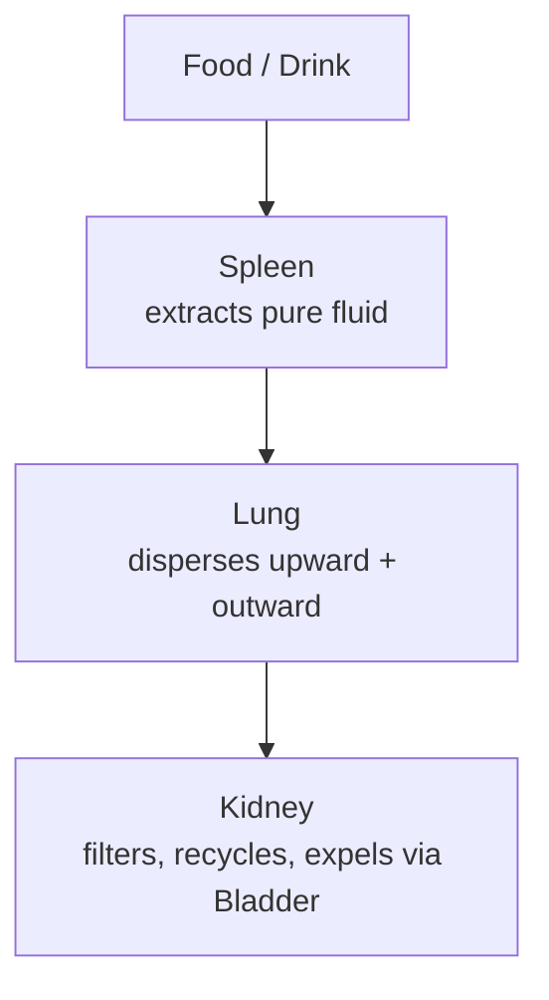

# Jin Ye — Body Fluids

## Overview

**Jin Ye** are the body's fluids: everything liquid that isn't Blood. In TCM they constitute the fifth Vital Substance alongside [Qi](Qi.md), [Xue](Xue.md), [Jing](Jing.md), and [Shen](Shen.md), with their own formation pathway, functions, and pathologies. Where the Three Treasures govern animation and consciousness, Jin Ye governs the body's hydration, lubrication, and thermoregulation.

In modern terms Jin Ye spans sweat, tears, saliva, gastric secretions, intestinal mucus, synovial fluid, cerebrospinal fluid, lymph, and the fluid component of every tissue — but TCM groups them by _function and consistency_ rather than anatomical compartment.

## Jin vs Ye

The category splits into two grades, classically described by the _Huangdi Neijing_:

| Grade   | Quality                     | Examples                                                         | Circulation                                  |
| ------- | --------------------------- | ---------------------------------------------------------------- | -------------------------------------------- |
| **Jin** | Clear, thin, light, mobile  | Sweat, tears, saliva, gastric juice, urine                       | Travels with Wei Qi to skin and exterior     |
| **Ye**  | Viscous, heavy, slow, dense | Synovial fluid, marrow fluid, cerebrospinal fluid, gastric mucus | Stays close to the organ or tissue it serves |

The distinction is clinically practical: _Jin_ deficiency shows up quickly (thirst, dry mouth, dry skin), while _Ye_ depletion takes time and presents deeper (joint stiffness, brain fog, marrow weakness). The two grades transform into each other when needed — chronic _Jin_ loss eventually depletes _Ye_.

## Formation and circulation

Fluid metabolism is a four-organ collaboration with the San Jiao as the connecting pathway:

- **Spleen** is the central engine: it separates clean fluid from food residue and lifts it upward to the Lung.
- **Lung** is the "upper source of water": it disperses fluid outward to the skin (sweat) and downward to nourish the body's surfaces.
- **Kidney** is the "lower source of water": it filters used fluid, returning the clean portion upward and excreting the turbid via Bladder.
- **[San Jiao](ZangFu.md)** (Triple Burner) is not an organ but the invisible irrigation network connecting all three — without it the fluid economy breaks down even when each individual organ works.

Heart and [Xue](Xue.md) drive blood-borne fluid distribution; Liver maintains smooth flow throughout the system. A failure in any of these organs (see [ZangFu.md](ZangFu.md)) shows up first in fluid metabolism.

## Primary functions

- **Moistening.** Skin, hair, mucous membranes, eyes, throat, mouth all require constant fluid replenishment. Dry skin, brittle nails, dry mouth, and constipation are Jin Ye signs before they are anything else.
- **Lubricating.** Joints (synovial fluid), eye movement (tears), and bowel transit (intestinal mucus) all depend on adequate Ye.
- **Thermoregulating.** Sweat is Jin Ye's primary tool for cooling — but excessive sweat depletes Jin and consumes Yang Qi simultaneously.
- **Cushioning and nourishing.** Cerebrospinal fluid pads the brain; marrow fluid supports bone and blood production (working with Jing, see [Jing.md](Jing.md)).
- **Supporting Blood.** A significant portion of Xue is fluid; severe Jin Ye depletion thins the Blood and produces Xue Deficiency signs downstream.

## Pathologies of fluid metabolism

Pathological fluid takes four major forms, each requiring different treatment.

### Phlegm (Tan)

Congealed thick fluid that has lost mobility. Phlegm divides into two clinically important categories:

- **Substantial Phlegm** — visible: catarrh, productive cough, lymph node enlargement, lipomas, ovarian cysts.
- **Insubstantial Phlegm** — invisible but pattern-defining: dizziness, brain fog, a sensation of a "lump" in the throat (_méi hé qì_), epilepsy, and the classical "**Phlegm misting the Heart orifices**" pattern that produces muddled thinking, confusion, and in severe cases psychosis (referenced in [Shen.md](Shen.md)).

Phlegm typically generates from chronic Dampness that wasn't resolved early enough.

### Dampness (Shi)

Pre-Phlegm — heavy, sticky, downward-leaning fluid stagnation. The hallmark signs are subjective: a sense of heaviness ("body feels like wet clothing"), brain fog, sluggish digestion, joint heaviness, thick greasy tongue coat. Damp accumulates from either:

- **External Damp** — humid environment, prolonged exposure to wet clothing, swimming in cold water (see [LiuYin.md](LiuYin.md))
- **Internal Damp** — Spleen failure to transform food into clean fluid; classical sequela of cold/raw diet, sweet foods, and overthinking

Damp left unresolved congeals into Phlegm; combined with Heat it becomes Damp-Heat (urinary tract infections, jaundice, eczema).

### Edema (Shui Zhong)

Overt fluid accumulation in tissue. Classical split:

- **Yang Edema** (acute, upper body) — Wind-Water pattern; sudden facial puffiness, often following Wind invasion.
- **Yin Edema** (chronic, lower body) — Kidney or Spleen Yang deficiency; pitting edema in ankles, weight gain, exhaustion.

### Dryness (Zao)

Insufficient fluid. Internal Dryness from Jin Ye depletion: dry skin, dry cough without sputum, dry stool, dry vagina, parched mouth, red dry tongue with little coating. External Dryness from autumn climate or air conditioning. Yin deficiency is the most common underlying pattern, since Jin Ye is fundamentally a Yin substance.

## Diagnostic signs

Fluid pathology is readable across several windows:

| Window         | Damp / Phlegm sign             | Dryness sign                |
| -------------- | ------------------------------ | --------------------------- |
| Tongue coating | Thick, greasy, possibly yellow | Thin or absent; dry         |
| Tongue body    | Pale and swollen with scallops | Red, thin, possibly cracked |
| Urine          | Cloudy, scanty                 | Dark, scanty, concentrated  |
| Stool          | Loose, sticky, undigested food | Dry, pellet-like            |
| Skin           | Greasy or swollen              | Dry, flaking, itchy         |
| Pulse          | Slippery (_hua_)               | Thin (_xi_) or rough (_se_) |

## Treatment principles

Each pattern has a named treatment principle that names what the formula must accomplish:

- **_Jian pi li shi_** — strengthen Spleen, drain Damp. The foundation for most Damp patterns.
- **_Hua tan_** — transform Phlegm. Different sub-strategies for cold-phlegm vs heat-phlegm vs wind-phlegm.
- **_Li shui_** — promote diuresis. For overt edema.
- **_Sheng jin_** — generate fluids. For Yin/Jin deficiency with dryness.

## Common fluid-regulating herbs and formulas

Traditional roles within formula context; not clinical dosing advice.

- **Fu Ling** (Poria) — gentle, broad-action Damp drainer; included in most fluid-regulating formulas. Calms the Shen as a secondary action.
- **Bai Zhu** (White Atractylodes) — Spleen Qi tonic that simultaneously dries Damp; the workhorse for Spleen-Damp patterns.
- **Ban Xia** (Pinellia) — the foundational Phlegm-transformer for cough and Stomach-Phlegm patterns; nearly always combined with Chen Pi.
- **Chen Pi** (aged tangerine peel) — regulates Qi and dries Damp; gently warming.
- **Ze Xie** (Alisma) — drains Damp via urination; cool, indicated for Damp-Heat patterns.

The canonical Phlegm-Damp formula is **Er Chen Tang** (Two Aged Decoction — Ban Xia + Chen Pi + Fu Ling + Gan Cao), the building block other Phlegm formulas modify. **Liu Jun Zi Tang** adds Ren Shen and Bai Zhu to address Spleen Qi deficiency as the root. **Wu Ling San** is the prototype edema formula, draining water and supporting Yang. For fluid-generating treatment, **Mai Men Dong Tang** nourishes Lung and Stomach Yin to relieve dryness.

## Fluid patterns by organ

Each major fluid-regulating organ has its own pattern signatures (see [ZangFu.md](ZangFu.md) for organ-system depth):

- **Spleen Damp** is the most common starting point — fatigue after meals, bloating, loose stools, scalloped tongue with greasy coat. Untreated, it ascends to Lung-Phlegm or descends as Damp accumulation in the lower burner.
- **Lung Phlegm** presents as productive cough, chest congestion, and post-nasal drip; the Lung's failure to disperse fluids upward and outward backs the system up.
- **Kidney Yang deficient water** is the deepest pattern — cold lower body, ankle edema, copious clear urine or oliguria, exhaustion. The "fire under the kettle" has gone out, so water no longer transforms.
- **Liver Qi stagnation with Damp** combines emotional pressure with fluid retention — premenstrual breast tenderness, alternating loose-and-bound stools, irritability.

## Modern parallels

The Jin Ye framework loosely maps onto several Western physiological systems:

- **Lymphatic system.** Stagnant Damp and Phlegm have intuitive analogies to lymph stasis and chronic interstitial fluid accumulation — though the TCM model predates the discovery of lymph vessels by two millennia and includes phenomena (insubstantial Phlegm) that have no clean biomedical correlate.
- **Interstitial fluid and ECF balance.** The Spleen-Lung-Kidney pathway broadly tracks fluid intake, distribution, and excretion. The mismatch is granularity: TCM operates at the level of patterns; biomedicine at the level of solute concentrations.
- **Mucous membranes.** Jin Ye's moistening function corresponds well to mucosal lubrication of eye, mouth, gut, and reproductive surfaces.

These are useful pedagogical bridges, not mechanistic equivalences. A patient with "Damp accumulation" may have an entirely normal lymphatic system on imaging — TCM is reading something functional that the equivalent biomedical category may not capture.
