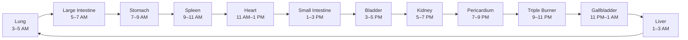

# Jingmai — Meridians

_Commonly known in English as "meridians" or "meridian channels" — the term most readers will recognize from acupuncture, this collection uses the pinyin **Jingmai** for filename consistency with the other documents._

## Overview

In Traditional Chinese Medicine, **meridians** (_Jingmai_) are an intricate network of invisible pathways through which Qi (vital life energy) and blood circulate throughout the body. Unlike the physical, anatomical pathways of Western medicine (blood vessels, nerves), meridians are a functional, energetic map. They connect the interior of the body (internal organs) to the exterior (skin, muscles, joints), ensuring that the entire system functions as a unified, holistic whole.

## Core principles

- **The flow of Qi.** Think of the meridians as a vast network of rivers and streams. When Qi flows smoothly and abundantly, the body remains in a state of health and harmony.
- **The root of disease.** If the flow of Qi is blocked, deficient, or stagnant (like a dammed river), the result is pain, emotional distress, or physical illness. The TCM maxim states: _"If there is free flow, there is no pain; if there is pain, there is no free flow."_
- **Yin and Yang balance.** The meridians are categorized into Yin and Yang pairs. **Yin meridians** are associated with solid, nurturing organs (Zang); **Yang meridians** are associated with hollow, processing organs (Fu).

## The 12 principal meridians

The backbone of the system consists of 12 primary meridians. They run symmetrically on both sides of the body and are divided between the arms and the legs. Each corresponds to a specific organ system, one of the Five Phases, and a specific 2-hour window of peak energy on the "TCM Organ Clock."

| Meridian Channel         | Extremity | Yin / Yang | Five Phases | Peak Energy Time | Primary Function & Emotional Link                                          |
| ------------------------ | --------- | ---------- | ----------- | ---------------- | -------------------------------------------------------------------------- |
| Lung                     | Arm       | Yin        | Metal       | 3 AM – 5 AM      | Controls respiration and immune defense; linked to grief / letting go.     |
| Large Intestine          | Arm       | Yang       | Metal       | 5 AM – 7 AM      | Eliminates waste and processes fluids; linked to stagnation or release.    |
| Stomach                  | Leg       | Yang       | Earth       | 7 AM – 9 AM      | Digests and extracts energy from food; linked to worry and anxiety.        |
| Spleen                   | Leg       | Yin        | Earth       | 9 AM – 11 AM     | Distributes nutrients and transforms fluid; linked to overthinking.        |
| Heart                    | Arm       | Yin        | Fire        | 11 AM – 1 PM     | Circulates blood and houses the mind/spirit (Shen); linked to joy.         |
| Small Intestine          | Arm       | Yang       | Fire        | 1 PM – 3 PM      | Separates pure nutrients from waste; linked to discernment.                |
| Bladder                  | Leg       | Yang       | Water       | 3 PM – 5 PM      | Removes liquid waste, largest channel; linked to fear and stress.          |
| Kidney                   | Leg       | Yin        | Water       | 5 PM – 7 PM      | Stores essence (Jing) and reproductive energy; linked to willpower / fear. |
| Pericardium              | Arm       | Yin        | Fire        | 7 PM – 9 PM      | Protects the heart physically and emotionally; regulates relationships.    |
| Triple Burner (San Jiao) | Arm       | Yang       | Fire        | 9 PM – 11 PM     | Not a physical organ; coordinates metabolism and fluid heat throughout.    |
| Gallbladder              | Leg       | Yang       | Wood        | 11 PM – 1 AM     | Stores bile, governs decision-making; linked to anger and courage.         |
| Liver                    | Leg       | Yin        | Wood        | 1 AM – 3 AM      | Smooths Qi flow, detoxes, regulates blood; linked to frustration / anger.  |

The 12 windows form a single closed 24-hour cycle — when one organ's peak ends, the next begins. The cycle restarts at the Lung (3 AM) every dawn:

_For the nature of Qi itself and its distinct types (Wei Qi, Ying Qi, Yuan Qi), see [Qi.md](Qi.md). For the underlying Wu Xing phase associations behind these peak times, see [WuXing.md](WuXing.md). For why the meridian system uses 12 channels (6 Zang + 6 Fu) instead of the 5-Zang framework of Wu Xing, see [ZangFu.md](ZangFu.md) and the [5-vs-6 Zang reconciliation](index.md#the-5-vs-6-zang-reconciliation)._

## Extraordinary Vessels

Beyond the 12 primary meridians, TCM recognizes **8 Extraordinary Vessels**. They act like reservoirs or "lakes" that store excess Qi and supplement the primary meridians when they are deficient. The two most prominent:

- **Conception Vessel (Ren Mai)** — Runs up the exact midline of the front of the body. Directs Yin energy and regulates reproduction.
- **Governing Vessel (Du Mai)** — Runs up the exact midline of the spine and head. Directs Yang energy and strengthens the nervous system.

## Acupoints and clinical applications

Dotted along these meridian pathways are over **361 standard acupuncture points** (acupoints). These points are specific locations on the skin where the energetic field of the meridian is highly accessible. By stimulating these points, TCM practitioners alter the flow of Qi to remove blockages or nourish deficiencies, through various modalities:

- **Acupuncture.** Inserting ultra-thin needles into acupoints to trigger a healing response.
- **Acupressure & Tui Na.** Applying physical pressure or massage along the meridian lines.
- **Moxibustion.** Burning the herb mugwort (_Ai Ye_) near the skin to warm the meridians and dispel "cold" or stagnation.
- **Qigong & Tai Chi.** Using specific movements, breathwork, and intention to clear and strengthen the meridian pathways from within.

## The Dantians

TCM recognizes three **Dantians** — reservoirs where [Qi](Qi.md) is gathered and stored, arranged along the body's central axis. Where the 12 primary meridians distribute Qi through the body like rivers, the Dantians concentrate it at three vertical hubs:

- **Lower Dantian** — a few inches below the navel, deep within the abdomen, on the acupoint **Qi Hai (Ren 6)** — the "Sea of Energy." Stores physical essence and vital energy; the most critical of the three. Deep abdominal breathing acts as a pump, filling this reservoir so excess energy can overflow and naturally heal the rest of the body.
- **Middle Dantian** — center of the chest, on **Shan Zhong (Ren 17)**. The seat of Qi cultivation and emotional regulation; benefits the Heart and Lung.
- **Upper Dantian** — between the eyebrows at **Yin Tang**. Houses the [Shen](Shen.md); cultivated through stillness and meditative focus.

### Relationship to chakras

The Dantians map onto the Vedic chakra system more cleanly than the meridian network does — both traditions describe a vertical column of energy centers along the body's midline, treating them as reservoirs that store and process subtle energy. The three Dantians align directly with three of the seven main chakras, on the same acupoints; the chakra system adds four more centers, each likewise sitting on a major TCM point along the Conception Vessel (Ren Mai) or Governing Vessel (Du Mai):

| Chakra                  | Location                 | TCM point & context                                                                                       |
| ----------------------- | ------------------------ | --------------------------------------------------------------------------------------------------------- |
| Crown (Sahasrara)       | Top of the head          | **Bai Hui (DU 20)** — "Hundred Meetings"; endpoint of the Governing Vessel; clears the mind.              |
| Third Eye (Ajna)        | Between the eyebrows     | **Yin Tang** — the **Upper Dantian**; calms the spirit, alleviates anxiety.                               |
| Throat (Vishuddha)      | Base of the throat       | **Ren 22** — Conception Vessel; used for throat issues and helping a person "find their voice."           |
| Heart (Anahata)         | Center of the chest      | **Shan Zhong (Ren 17)** — the **Middle Dantian**; benefits lungs and heart; opens the chest during grief. |
| Solar Plexus (Manipura) | Upper abdomen            | **Zhong Wan (Ren 12)** — central hub for the Stomach and Spleen; governs digestion.                       |
| Sacral (Svadhisthana)   | Lower abdomen            | **Qi Hai (Ren 6)** — the **Lower Dantian**; primary reservoir of physical essence and vital energy.       |
| Root (Muladhara)        | Perineum / base of spine | **Hui Yin (Ren 1)** — "Meeting of Yin"; lowest point of the central torso, grounds energy into the earth. |
