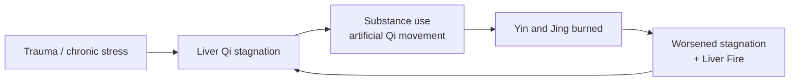

# Liver (肝 — Gān)

## Overview

The Liver in Traditional Chinese Medicine is not the anatomical organ of Western physiology. Capitalized to distinguish it from its biological counterpart, the **Liver** is a vast functional and energetic network — what TCM calls the "General" or "Military Commander" of the body. Its primary responsibility is to ensure the smooth, unhindered flow of Qi (see [Qi.md](Qi.md)), [Xue (Blood)](Xue.md), and emotions throughout the entire system.

This document covers the Liver as a TCM organ system first, then turns to one of its most consequential clinical applications: the TCM view of addiction. Western medicine frames addiction as a brain-reward disorder centered on dopamine pathways; TCM frames it as a disruption of Qi flow, an imbalance of Yin and Yang, and a destabilization of the spirit — with the Liver at the center of the storm.

## The Liver in TCM

### Primary function: smooth flow

The Liver's central job is to ensure the free coursing (_shu xie_) of Qi, Blood, and emotions. When the Liver functions well:

- Emotions flow like a river — anger, sadness, and joy come and go naturally without getting stuck.
- Digestion is good, blood circulates seamlessly, and tendons and muscles remain flexible.
- A person feels adaptable, relaxed, and emotionally resilient.

When the Liver fails at this job, the consequences ripple through every other organ system.

### Storing the Blood

The Liver stores **Xue** (Blood). During activity, the Liver releases Blood to the muscles, eyes, and tendons; during rest, the Blood returns to the Liver to be replenished. Because Xue is the physical anchor for the [Shen (mind/spirit)](Shen.md), the Liver's capacity to store rich, ample Blood directly affects mental calm, sleep, and the quality of dreams.

### Housing the Hun

Every Zang organ houses a specific aspect of the psyche. The Liver houses the **Hun** (the "Ethereal Soul"), responsible for:

- Life purpose, vision, and long-term direction
- Dreams, imagination, and the ability to envision the future
- Planning and the exercise of self-control

When the Liver is healthy and well-nourished by Yin and Blood, the Hun is rooted and peaceful. When the Liver is depleted or agitated, the Hun becomes unanchored and wanders — manifesting as aimlessness, chaotic dreaming, disconnection from oneself, and an inability to hold to long-term intentions.

### Position in the wider system

| Aspect             | Liver                                                                  |
| ------------------ | ---------------------------------------------------------------------- |
| Wu Xing phase      | Wood (see [WuXing.md](WuXing.md))                                      |
| Paired Fu organ    | [Gallbladder](Gallbladder.md)                                          |
| Sensory opening    | Eyes                                                                   |
| Tissue             | Tendons                                                                |
| Associated emotion | Anger / frustration (see [QiQing.md](QiQing.md))                       |
| Organ clock        | 1 AM – 3 AM (Gallbladder: 11 PM – 1 AM) — see [Jingmai.md](Jingmai.md) |
| Season             | Spring                                                                 |
| Flavor             | Sour                                                                   |

**The Liver-Kidney axis.** A foundational TCM teaching is that _"the Liver and Kidneys share the same root."_ The [Kidneys](Kidney.md) store [Jing (Essence)](Jing.md); the Liver stores Blood; and Jing can transform into Blood (and vice versa). This makes the Liver and Kidneys functionally interdependent — a chronic depletion of one will eventually drag down the other.

## Common Liver pathologies

These patterns recur throughout TCM clinical practice. They are not limited to addiction, though they are central to it.

### Liver Qi stagnation

The most common Liver disorder. Chronic stress, suppressed anger, frustration, or trauma cause Liver Qi to bottleneck. Symptoms include a tight chest, lump-in-the-throat sensation, sighing, distention, moving pains, irritability, PMS, and depression.

### Liver Fire blazing upward

When stagnant Qi sits too long, frictional heat builds and ignites. Liver Fire rises and attacks the upper body. Symptoms: red eyes, headaches, bitter taste in the mouth, sudden rage, vivid dreams, insomnia.

### Liver Yang rising

Often arises from chronic Liver Yin or Kidney Yin deficiency — Yang has nothing to anchor it. Symptoms: dizziness, tinnitus, hypertension, irritability, neck/shoulder tension, occipital headaches.

### Liver Blood deficiency

The Liver lacks enough Blood to nourish tendons, eyes, and the Hun. Symptoms: blurred vision, brittle nails, scant or pale menstruation, muscle cramps, numbness in extremities, anxiety, and difficulty falling asleep.

### Liver Yin deficiency

The cooling, moistening substance is exhausted. Symptoms: dry eyes, night sweats, hot flashes, restless sleep, "five-palm heat," and a red tongue with a peeled coating.

## The TCM view of addiction

Whether to substances (alcohol, opioids, stimulants, nicotine, sugar) or to behaviors (gambling, doom-scrolling, binge eating), addiction is treated in TCM as a profound disruption of the Liver's job. The Liver is "ground zero" of both the underlying vulnerability and the agony of withdrawal.

### Why the Liver is "ground zero"

Addiction fundamentally alters emotional state, impulses, and internal chemistry — exactly the domains the Liver governs. Where Western medicine sees a neurological problem of reinforcement and craving, TCM sees an energetic problem of stagnation, fire, and a destabilized spirit.

### The cycle

**Phase 1 — The stuck feeling.** Liver Qi stagnation creates intense internal tension: irritability, anxiety, depression, a tight chest, an inability to feel comfortable in one's own skin. The person craves anything that will move the energy.

**Phase 2 — The substance as a Qi mover.** Alcohol, cannabis, opioids, nicotine, and stimulants all act as potent artificial movers of Qi. Alcohol is inherently warm and moving; it forcefully breaks the stagnation, producing immediate relief, relaxation, or euphoria. The "General" is briefly allowed to let energy flow.

**Phase 3 — The crash.** The relief is artificial and chemically toxic. Most addictive substances are inherently hot and drying. Repeated use burns through Liver and Kidney Yin and depletes Jing. As Liver Yin dries up, the Liver loses its ability to anchor and soften its own Yang — producing **Liver Yang rising** or **Liver Fire blazing upward**, with intense cravings, severe insomnia, rage, and a hyper-irritable nervous system. When the substance wears off, the Qi stagnates more severely than before, and a larger dose is needed to achieve the same temporary release.

### Cross-organ consequences

Because TCM is fundamentally interconnected, a crisis in the Liver ripples through every other system via the Wu Xing cycles.

**Liver → Heart (Wood feeds Fire).** The [Heart](Heart.md) houses the Shen. As Liver Fire travels upward, it scorches the Heart-Yin and Blood that normally anchor the Shen. The Shen becomes "homeless," producing the psychological hallmarks of active addiction and withdrawal: obsessive thoughts, loss of impulse control, racing thoughts, paranoia, and erratic behavior. The "Emperor" (Shen) has lost control of the kingdom.

**Liver → Spleen (Wood overacting on Earth).** Wood is supposed to gently regulate Earth. A hyperactive, addiction-stressed Liver instead crushes the [Spleen](Spleen.md), impairing the manufacture of Gu Qi and, downstream, the body's ability to produce fresh Xue. This is why active addiction so often produces appetite loss, nausea, and severe GI distress — and why Xue deficiency then leaves even less substance to anchor the increasingly homeless Shen.

**Liver → Kidney (Wood exhausting Water).** Water (Kidney) is the "mother" of Wood (Liver) and the seat of **Zhi** (willpower) and Jing (essence). Chronic Liver Fire drains Kidney Water, eventually exhausting Jing itself. The result: actual willpower evaporates, making it nearly impossible to break the cycle through sheer force of mind. The "trust fund" of constitutional energy is being raided to fund a counterfeit Yang.

**The Hun unanchored.** As Liver Yin is depleted, the Hun loses its physical home. Addicts experience dream-disturbed sleep, a total loss of life direction, and a deep existential aimlessness. The Hun gives us our drive and our vision for the future; when it wanders, only the immediate moment exists, and substances fill that moment.

### Withdrawal dynamics

During detox, the Liver system bears the brunt of the load.

- **Damp-Heat in the Liver and Gallbladder.** Processing the chemical load overwhelms the Liver, producing nausea, body aches, night sweats, a bitter taste in the mouth, and a yellow, greasy tongue coating.
- **The emotional surge.** Because the substance is no longer forcing Liver Qi to move, all the suppressed emotions the addiction had numbed — rage, grief, frustration — come back at once. Early recovery is often marked by violent mood swings and volatile anger; the Liver is literally "clogged" with unexpressed emotion.

## TCM treatment of addiction

Because the Liver is the root of the imbalance, recovery protocols focus on soothing Liver Qi, clearing Liver Fire, nourishing the depleted Yin and Blood, and re-anchoring the Shen and Hun.

### Acupuncture

**The NADA Protocol.** Developed in the 1970s at Lincoln Hospital in New York, the NADA (National Acupuncture Detoxification Association) protocol is a standardized 5-point ear acupuncture treatment used worldwide in addiction clinics, behavioral health, prison systems, and disaster relief. The five points each target a specific dimension of addiction:

| Point       | Function in recovery                                                                                  |
| ----------- | ----------------------------------------------------------------------------------------------------- |
| Sympathetic | Calms the nervous system, pulling the patient out of the agitated "fight-or-flight" of withdrawal.    |
| Shen Men    | "Spirit Gate" — calms the mind, alleviates anxiety, grounds the Master Shen to reduce acute cravings. |
| Kidney      | Supports the root of willpower (Zhi), heals the core Jing, relieves the primal fear of withdrawal.    |
| Liver       | Aids physical detoxification, smooths Liver Qi, eases anger and frustration.                          |
| Lung        | Helps the body "let go" and addresses the grief and sadness often underlying addiction.               |

**Key body acupoints.**

- **LV 3 (Taichong)** — Source point of the Liver meridian, on the foot. The ultimate point for melting away stress, smoothing Liver Qi, and reducing the physical tension associated with cravings.
- **KD 3 (Taixi)** — Source point of the Kidney meridian; strongly tonifies Kidney Yin and Yang, restoring the depleted reserves of long-term addiction.
- **Du 4 (Mingmen)** — On the spine between the kidneys; rekindles the constitutional fire.
- **Ren 4 (Guanyuan) and Ren 6 (Qihai)** — On the lower abdomen; access the Dantian to fortify Original Qi and Essence.

### Herbal medicine

Different herbal formulas target different phases of the addiction cycle.

- **Xiao Yao San** ("Free and Easy Wanderer") — The classic formula for Liver Qi stagnation. Gently smooths Liver Qi, strengthens the Spleen, and nourishes the Blood. Used throughout recovery to ease anxiety, stabilize mood swings, and address the emotional volatility that drives relapse.
- **Chai Hu Jia Long Gu Mu Li Tang** (Bupleurum, Dragon Bone, and Oyster Shell Decoction) — Used for drug and nicotine withdrawal. Regulates Liver Qi to drop stress levels while heavy minerals and shells physically anchor the floating, anxious spirit.
- **Long Dan Xie Gan Tang** — A heavy-duty formula used during acute detox to purge **Liver Fire** — cooling the intense, raging agitation of withdrawal, the red eyes, the bitter taste, and the explosive anger.
- **Ge Hua Jie Xing Tang** (Kudzu Flower Decoction) — Used specifically for alcohol recovery. Neutralizes damp-heat toxins and rejuvenates the damaged Liver system.

### Lifestyle

Recovery is not purely a matter of needles and herbs. The person must learn to move their own Qi safely so that emotional blockages do not re-form once the substance is no longer doing the work.

- **Qigong and Tai Chi.** Liver-stretching forms (especially twisting movements through the flanks) physically release the energetic knots that trigger relapse. Practiced daily, they keep the "General" content and the Qi flowing smoothly. See [Qigong.md](Qigong.md).
- **Breathwork and creative expression.** Healthy outlets for Wood-energy: drumming, writing, painting, vigorous walking, deliberate vocalization. Wood needs to move; recovery is partly about giving it somewhere to go.
- **Sleep before midnight.** The Liver's organ-clock window (1–3 AM) is its time of deepest replenishment. Sleeping through that window — and the Gallbladder's 11 PM – 1 AM window — gives the Liver the physiological space to detoxify and rebuild.

## The holistic perspective

From a TCM standpoint, a person struggling with addiction is not dealing with a chemical dependency in isolation, and not failing a test of willpower. They are experiencing an energetic traffic jam (Liver Qi stagnation) that has disconnected them from their life's purpose (the Hun), agitated their mind (the Shen), and drained their constitutional reserves (Jing and Kidney Yin). Healing involves clearing the traffic — through needles, herbs, movement, and time — so the spirit can safely return home.

## See also

- [ZangFu.md](ZangFu.md) — Zang-Fu framework and cross-organ axes
- [Gallbladder.md](Gallbladder.md) — paired Fu organ; Wood-phase decision-maker
- [Kidney.md](Kidney.md) — the Liver's "shared root" partner
